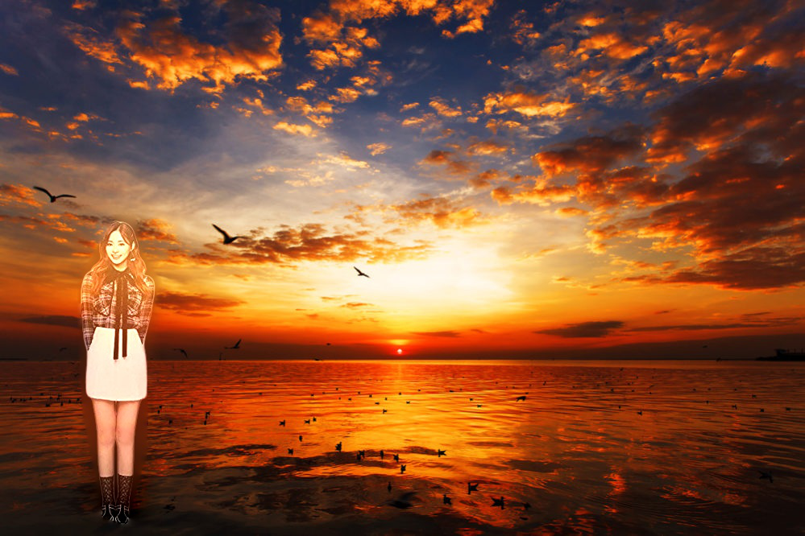

# photocomposition
this is the instagram bot for uploading fake image(tzuyu) automatically
this is the program for creation of Tzuyu's(Twice) composite photograph  
## output
### blur
  
### seamless
  
## Order
1.scraping  
  collection of tzuyu's image by google   
2.trimming  
  removement of original background (https://www.remove.bg)  
3.composition  
  Synthesis of a tzuyu's image and the background you want  
4.upload
  uploading to instagram 

* now I've already finished 1,3,4 but I can't create code for reCAPTCHA.
